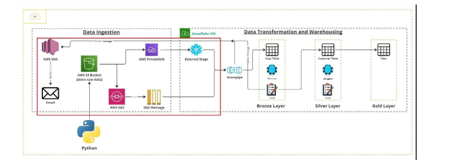
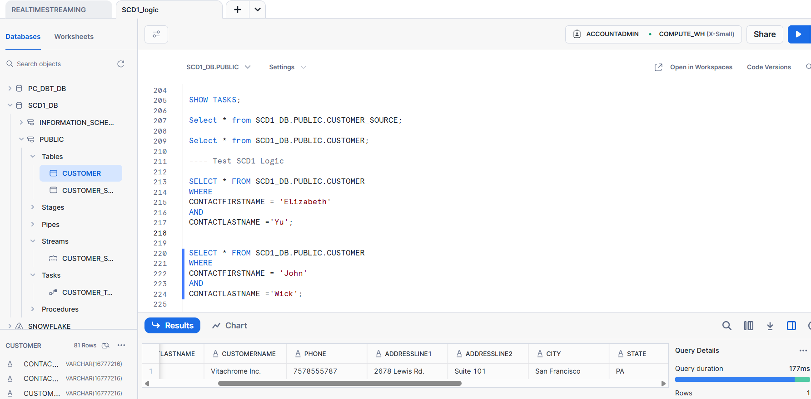

## SCD1 Logic

ETL SCD1 using Snowflake Tasks, Streams and Stored Procedures
Objective
This project implements a pipeline to handle full data loads and change data (CDC) file from a Python process, store the data in AWS S3, and use Snowflake’s native features — Snowpipe, Streams, Tasks, and Stored Procedures — to automatically load and update a Customer table with SCD Type 1 logic.

 

#### What is Slowly Changing Dimension(SCD) Type1?

Slowly Changing Dimensions are dimensions (like Customer, Product, Employee) whose attributes change slowly over time, not every day like transactions.

For example:

A customer changes their email address.
A product gets a new description.
An employee updates their job title.

SCD Type 1 simply overwrites the old data with the new data.

### How It Works

#### Data Upload:

A Python script (running in an Anaconda notebook) takes the downloaded full extracts and incremental change files from your local machine. These dataset is already shared as part of the project

The script uploads these files to a designated S3 bucket.

#### Storage Integration:

AWS S3 and Snowflake are connected via:

Storage Integration: secure way for Snowflake to read files from S3.

External Stage: defines the S3 location inside Snowflake.

#### Automated Data Load with Snowpipe

Snowpipe continuously monitors the S3 stage.

When new files arrive (full or CDC), Snowpipe automatically copies the data into a Customer Source table (CUSTOMER_SOURCE).

✅ Benefit: Fully automated, near real-time ingestion without manual loading.

#### Change Processing with Streams

The Stream tracks new or changed rows that were loaded by Snowpipe.

✅ Benefit: Snowflake knows exactly which rows are new or updated, making incremental processing simple.

Automated Processing with Tasks & Stored Procedures

### The Stored Procedure: (SCD1_logic.sql)

Reads the change data from the Stream.

Merges it into the target CUSTOMER table using SCD Type 1 logic:

If the customer ID exists → update the changed attributes (e.g., overwrite address or email).

If the customer ID is new → insert it.

This is typically done using a MERGE statement.

✅ Benefit: The entire SCD1 flow is automated — no manual steps to merge data.

