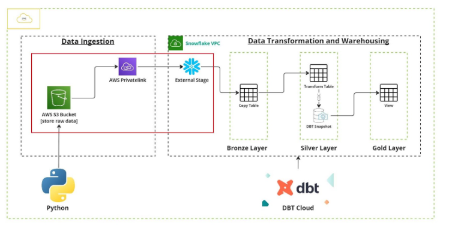
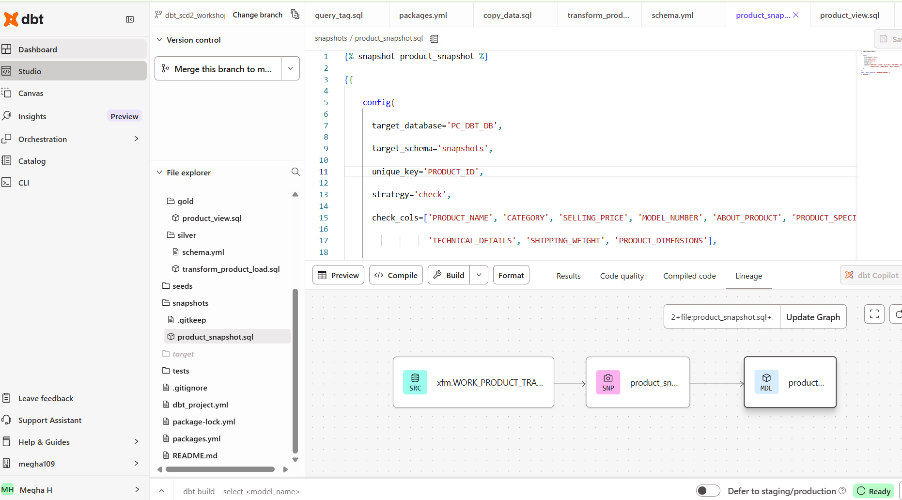
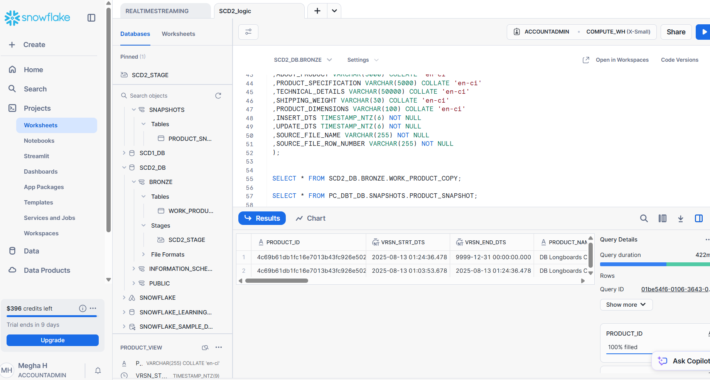

# Data Ingestion Pipeline: AWS S3 → Snowflake → DBT (Medallion Architecture with SCD Type 2)

## Overview
This project demonstrates an end-to-end **data ingestion and transformation pipeline** where:
- **AWS S3** stores raw data files.
- **Snowflake** serves as the data warehouse.
- **DBT (Data Build Tool)** organizes transformations into the **Medallion Architecture**:
  - **Bronze Layer**: Raw data ingestion
  - **Silver Layer**: Cleansed and conformed data
  - **Gold Layer**: Aggregated and business-ready data
- **SCD Type 2** is implemented in the Silver/Gold layers for historical tracking of changes.

---

## Architecture

Source Data → AWS S3 (Bronze) → Snowflake (Bronze Table) → DBT Silver Models → DBT Gold Models

## Execution

